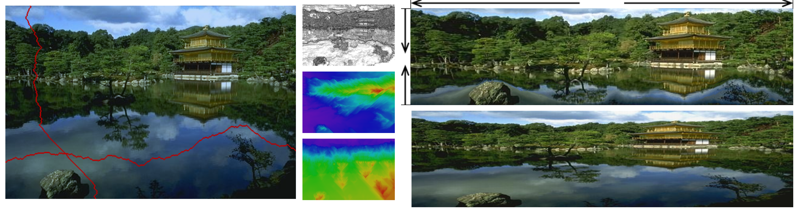
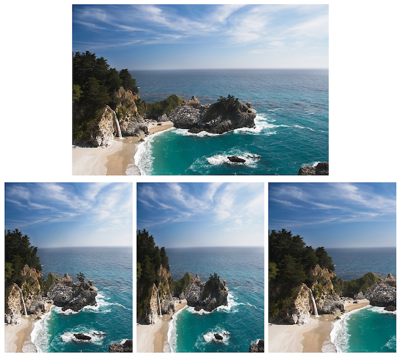
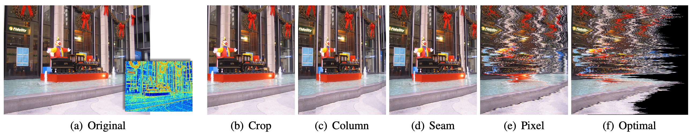
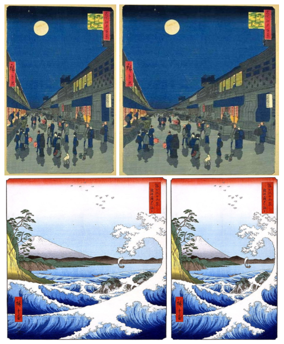
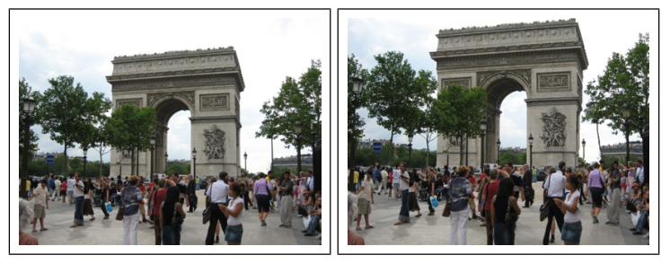
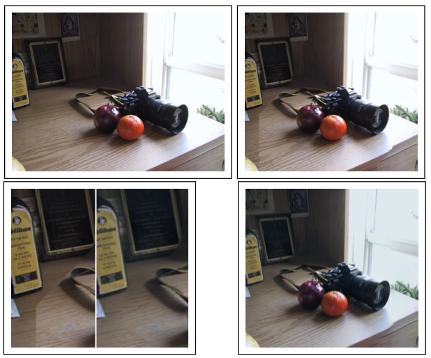
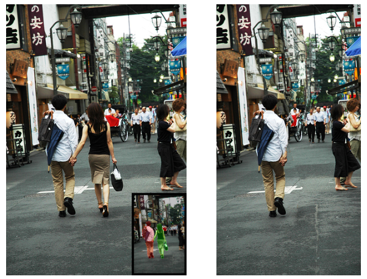
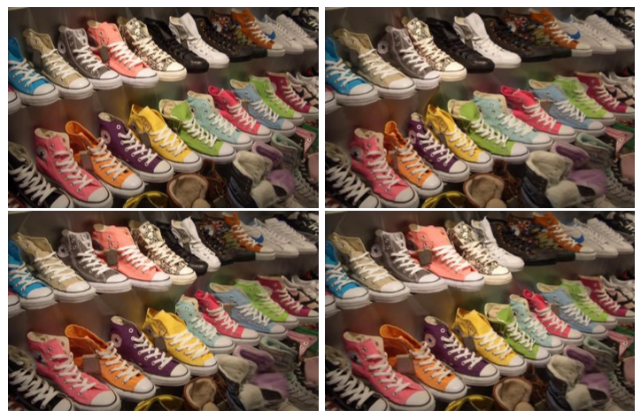

<!--
    This slides is written in Markdown and powered by Marp(https://marp.app/).
  -->

# Seam Carving

杨思祺 李琦煜 张远鹏
 
2020/03/13

---

# 背景

在 Seam Carving 之前也有一些图像伸缩、裁剪算法 
- 忽视图像内容信息
- 丢失图像边缘内容

---

上：原图，下：Seam Carving, Scaling, Cropping

---

# 概念

- Energy Map 像素点的重要程度，值越大，越重要
    - gradient magnitude
    - entropy
    - others
- Seam
    - 水平：从左端到右端，每列一像素
    - 竖直：从顶端到底端，每行一像素
    - 一般是 8 联通
    - Seam 的 Energy 就是各个像素点的 Energy 之和

---

# 思想

Energy 越低的 Seam 越不被关注，修改这些地方更自然

---

# 插曲

为什么要寻找 Seam 呢？直接找 Energy 最低的 点/行/列 删不好吗？

---

# 动态规划

怎么找 Seam 呢？

以 8 联通求解 Energy 最低的竖直 Seam 为例

$$ M(i,j) = e(i,j) + min_{j-1\leq k\leq j+1}\{ M(i-1,k) \} $$

---

# 缩小图片

将 $n\times m$ 的图片转化为 $n\times m'$ 的图片，其中 $\Delta m = m - m' > 0$

0. 执行下述过程（1~3）共 $\Delta m$ 次
1. 对当前图片求 Energy Map
2. 用动态规划寻找 Energy 最低的竖直 Seam
3. 从图片上移除这条 Seam 上的所有像素点，并把左右两部分拼在一起

---

# 放大图片

将 $n\times m$ 的图片转化为 $n\times m'$ 的图片，其中 $\Delta m = m' - m > 0$

## 方法1

类似上面，不断寻找最低 Energy 的竖直 Seam 并把每个像素扩展为两个像素

## 方法2

寻找最先被移除的 $\Delta m$ 条竖直 Seam 再扩展这些 Seam

## 方法3

分为若干个阶段，限制每个阶段扩展的 Seam 条数

---

# 曲线救国

如果希望缩小 $n\times m$ 图片到 $n\times m'$，其中 $m' < m$
既可以通过移除 $m - m'$ 条竖直的 Seam 完成
也可以通过扩展 $n(\frac{m}{m'} - 1)$ 条水平 Seam 再整体缩小完成

---

 两幅作品均是通过扩增 Seam 方法加宽的

---

# 移除顺序

考虑将 $n\times m$ 图片缩小到 $n'\times m'$，其中 $n' < n, m' < m$

可以通过移除 $n - n'$ 条水平 Seam 和 $m - m'$ 条竖直 Seam 完成任务

但是应当按什么顺序移除呢？

- 为所欲为
    - 先移除所有水平的，再移除所有竖直的
    - 先移除所有竖直的，再移除所有水平的
- 交替移除
    - 移除一条水平的，移除一条竖直的，交替进行
- 全局最优
    - 力求移除的 Seam 总 Energy 最小

$$
T(r,c) = min\{
    T(r-1,c) + E(s^X(I_{n-r+1\times m-c})), 
    T(r,c-1) + E(s^Y(I_{n-r\times m-c+1}))
\}
$$

---

# 内容增强

先拉伸图片，再用 Seam Carving 通过移除低 Energy 的 Seam 将图片变回原尺寸

---

# 联动泊松

Seam Carving 不仅可以直接移除图片的像素值，也可以作用在梯度场上

- 根据原图计算 Energy Map
- 计算 Energy 最低的 Seam
- 删除梯度场中的对应的点
- 用 Posson Solver 重建图片

---

左上原图，右上普通，右下泊松，左下对比

---

# 大变活人

人为标记需要去除的区域，不断移除经过该区域的 Energy 最低的 Seam

---

# 大变活鞋

如果不希望图片尺寸改变，可以再用 Seam 扩张的方法补至原尺寸

---

# 回顾反思与展望

- 固定的 Seam Carving 算法不一定适用于所有情形
    - 调整 Energy Map 计算方法
    - 人为标记
- 图片内容过于密集，没有可以下手的 Seam
- 图片含有固定图形，比如直线、圆等
- 改变视频的尺寸仍待解决

---

# 完

感谢倾听
欢迎提问

